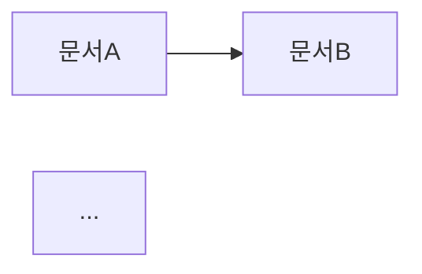

# knowledge_map — 프로젝트별 지식 그래프

papyrus 문서들의 wikilink 관계를 분석하여 프로젝트 지식 맵을 생성하는 스킬.

## 워크플로우

1. `~/papyrus/` 내 모든 `.md` 파일을 스캔한다.
2. 각 파일에서 `[[wikilink]]` 패턴을 정규식으로 추출한다.
3. 파일 간 링크 관계를 adjacency list로 정리한다.
   - `{ "파일A": ["파일B", "파일C"], "파일B": ["파일D"] }` 형태
4. **고아 문서(orphan)** 식별: 어디서도 링크되지 않고, 다른 문서를 링크하지도 않는 문서를 찾는다.
5. **허브 문서** 식별: 가장 많이 참조(백링크)되는 상위 문서를 찾는다.
6. **Mermaid 다이어그램** 형식으로 시각화 코드를 생성한다.
   - 노드가 너무 많으면 상위 N개 허브 중심으로 서브그래프를 그린다.
7. 결과를 `~/papyrus/resources/지식맵_{날짜}.md`에 저장한다.

## 출력 형식

```markdown
---
tags: [knowledge-map, graph]
date: {날짜}
---

# 지식 맵 — {날짜}

## 요약
- 총 문서 수: N
- 링크 수: M
- 고아 문서 수: K
- 허브 문서 상위 5개: ...

## 허브 문서 (가장 많이 참조됨)
| 순위 | 문서 | 백링크 수 |
|------|------|-----------|
| 1    | ... | ... |

## 고아 문서
- ...

## 관계 그래프 (Mermaid)


## 참고자료 (References)
없음
```

## 주의사항
- `.obsidian/` 폴더는 스캔에서 제외한다.
- `attachments/` 폴더 내 비-md 파일은 제외한다.
- wikilink에서 `|alias` 부분은 제거하고 실제 문서명만 추출한다 (예: `[[문서|별칭]]` → `문서`).

## 검증 기준

- [ ] papyrus 문서의 wikilink가 분석됨
- [ ] 관계 맵이 시각적으로 제시됨
- [ ] 고립된 문서(링크 없음)가 식별됨

## 변경 이력

| 날짜 | 변경 내용 | 트리거 |
|------|----------|--------|
| 2026-03-07 | 초기 생성 | 사용자 요청 |
| 2026-03-10 | 검증 기준, 변경 이력 추가 | /anima improve |
